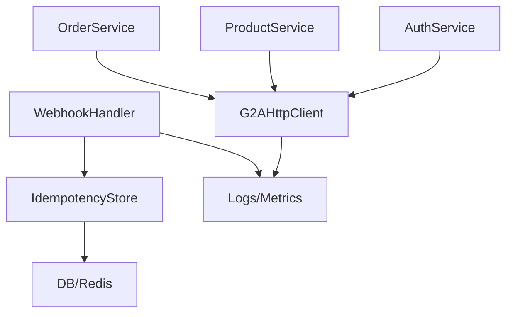

# G2A Integration Handoff

## Scope
Backend integration with G2A Integration API, including client calls, order creation, webhook handling, observability, and ops readiness.

## Artifacts
- `specs/011-g2a-integration-audit/spec.md`
- `plan.md`, `tasks.md`, `data-model.md`, `contracts/g2a-api-contracts.md`, `quickstart.md`, `backend-audit.md`

## Env & Config
- Required: `G2A_API_URL` (must include `/integration-api/v1` for production Import API, `/v1` for Export API and sandbox), `G2A_API_KEY`, `G2A_API_HASH` (or `G2A_API_SECRET` for backward compatibility - deprecated), `G2A_ENV` (sandbox|live)
- Optional: `G2A_TIMEOUT_MS` (default 8000), `G2A_RETRY_MAX` (default 2)
- Non-prod should default to sandbox; enforce HTTPS and host allowlist.

## Architecture Flow

## Operability Checklist
- Logging: method/path/status/latency/retries; mask secrets.
- Metrics: success/error/retry counters; latency histograms; token TTL gauge; webhook validation failures.
- Health: endpoint checks token probe + idempotency store connectivity.
- Security: signature/nonce/timestamp validation for webhooks; idempotent processing; secrets not logged.

## Testing
- Unit: URL validator, signature/nonce/timestamp, retry policy, mappers.
- Integration (sandbox): token, product list/detail, order create, negative creds.
- E2E: token → product → order → simulated webhook; verify idempotency.

## Handoff Steps
1. Verify env vars populated and secrets stored securely (vault/.env). 
2. Run lint/build/tests.
3. Execute sandbox smoke (see quickstart).
4. Review logs/metrics dashboards for G2A calls.
5. Switch `G2A_ENV` to live only after sandbox pass; confirm base URL.
